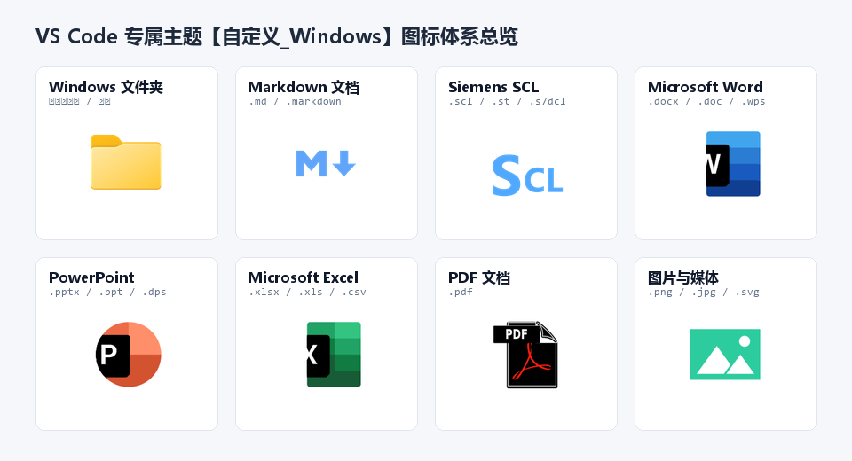

# 自定义_Windows (Custom Windows Icons)

> 🪟 **专为 Windows 用户与新手打造的 VS Code 原生风格文件图标主题**



---

## 📖 项目简介 (Introduction)

**“自定义_Windows”** 是一款为 Visual Studio Code 与 Antigravity IDE 量身定制的文件与文件夹图标主题。

本项目的设计初衷在于：许多初学者和 Windows 资深用户在进入 VS Code 时，面对各类第三方插件抽象或扁平的图标风格往往容易产生认知负担。本主题通过引入大家最熟悉、最符合直觉的 Windows 原生立体视觉风格，使工程目录层次更分明、图标含义一目了然，让你的 VS Code 对新手更易上手、更加美观舒适！

---

## ⚖️ 声明与版权说明 (Disclaimer & Rights)

> [!NOTE]
> **重要声明**：
> 1. 本项目主要将 Windows 原生系统、Microsoft Office 系列办公软件及常用开发环境的经典视觉图标内容进行了**迁移、汇总、适配与优化**。
> 2. 本项目**不享有**任何 Windows 原生图标、Microsoft 品牌及第三方工具图标的原创发明权或商标专有权，所有相关视觉资产的版权归属原作者/原公司所有。
> 3. 本项目仅拥有**汇总整理、格式适配、中转分发与开源配置权**，旨在为开发者社区提供一个更加顺手美观的本地开发环境体验。

---

## ✨ 核心特性 (Features)

* 📂 **Windows 官方立体文件夹**：还原 Windows 资源管理器原生的黄色立体文件夹质感，支持折叠与展开双态。
* 📘 **Antigravity 专属 Markdown**：采用亮蓝色透明底 `M↓` 标志，清新醒目。
* ⚡ **Siemens SCL 专属支持**：采用透明底色蓝色 `SCL` 标志，工控开发更直观。
* 📑 **Office 原生全家桶**：
  * **Word** (`.docx`, `.doc`, `.wps`)
  * **Excel** (`.xlsx`, `.xls`, `.csv`, `.et`)
  * **PowerPoint** (`.pptx`, `.ppt`, `.dps`)
  * **PDF** (`.pdf`)
* 🖼️ **系统级多媒体与归档**：图片 (`.png`, `.jpg`, `.svg` 等)、压缩包 (`.zip`, `.rar`, `.7z` 等)、纯文本 (`.txt`, `.log` 等)。
* 💻 **主流代码文件**：Python、C/C++、Java、JavaScript/TypeScript、HTML/CSS、JSON、XML 等。

---

## 🚀 安装与使用 (Usage)

1. 将本扩展文件夹放入 VS Code 扩展目录：
   ```
   %USERPROFILE%\.vscode\extensions\custom-windows-icons
   ```
2. 打开 VS Code，按下快捷键 <kbd>Ctrl</kbd> + <kbd>Shift</kbd> + <kbd>P</kbd>。
3. 输入并选择 **`Preferences: File Icon Theme`**（首选项: 文件图标主题）。
4. 在列表中选择 **`自定义_Windows`** 即可立即生效！

---

## 🤝 贡献与反馈

欢迎提交 Issue 与 Pull Request 补充更多文件类型的 Windows 风格图标映射！
